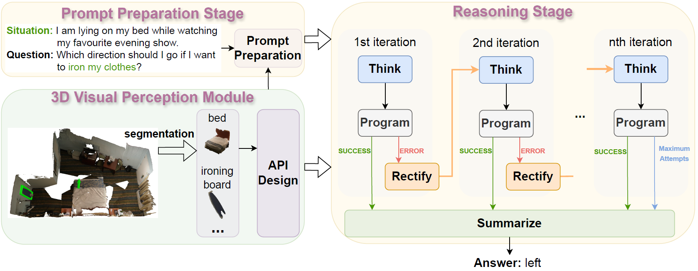

# LLM-TPC
Code for paper "Think-Program-reCtify: 3D Situated Reasoning with Large Language Models"


## Install
```Shell
conda create -n llm-tpc python=3.9 -y
conda activate llm-tpc
pip install openai==0.28 numpy scikit-learn matplotlib omegaconf torch torch_redstone einops tqdm open_clip_torch trimesh plyfile shapely
pip install dgl-cu113 -f https://data.dgl.ai/wheels/repo.html
```

## Dataset
Organize the data as follows in `data`.
```Shell
data
├── openshape
│   ├── model.pt
│   └── open_clip_pytorch_model.bin
├── qa
│   ├── answer_counter.json
│   └── SQA_balanced_test.json
├── scans
│   ├── scene0000_00
│   │   ├── scene0000_00_vh_clean_2.0.010000.segs.json
│   │   ├── scene0000_00_vh_clean_2.labels.ply
│   │   ├── scene0000_00_vh_clean_2.ply
│   │   ├── scene0000_00.aggregation.json
│   │   └── scene0000_00.txt
│   └── ...
└── scannetv2-labels.combined.tsv
```

### ScanNet
To acquire the access to ScanNet dataset, please refer to [ScanNet](https://github.com/ScanNet/ScanNet) and follow the instructions there. You will get a `download-scannet.py` script after your request for the ScanNet dataset is approved. Use the commands below to download the portion of ScanNet that is necessary for LLM-TPC:
```Shell
python download-scannet.py -o data --type _vh_clean_2.0.010000.segs.json
python download-scannet.py -o data --type _vh_clean_2.labels.ply
python download-scannet.py -o data --type _vh_clean_2.ply
python download-scannet.py -o data --type .aggregation.json
python download-scannet.py -o data --type .txt
```

### SQA3D

### OpenShape


## Inference
```Shell
cd scripts
# Input your OPENAI_API_KEY in 'no_caption-openshape-gt_seg-gt_label/config.json'
python example.py --agent no_caption-openshape-gt_seg-gt_label/config.json
```

## Evaluate
```Shell
cd scripts
python eval.py --log_dir ../logs/test/no_caption-openshape-gt_seg-gt_label
```

## Acknowledgement
- [Agents](https://github.com/aiwaves-cn/agents): the codebase we built upon.
- [Mask3D](https://github.com/JonasSchult/Mask3D): we use the ScanNet200 test checkpoint for 3D instance segmentation. Specifically, we apply the same instance segmentations provided by [3D-VisTA](https://github.com/3d-vista/3D-VisTA) which can be found [here](https://github.com/3d-vista/3D-VisTA/issues/12).
- [ReferIt3D](https://github.com/referit3d/referit3d): we design APIs for spacial relation recognition based on ReferIt3D.
- [OpenShape](https://github.com/Colin97/OpenShape_code): we design APIs for open-vocabulary object attribute classification based on OpenShape.